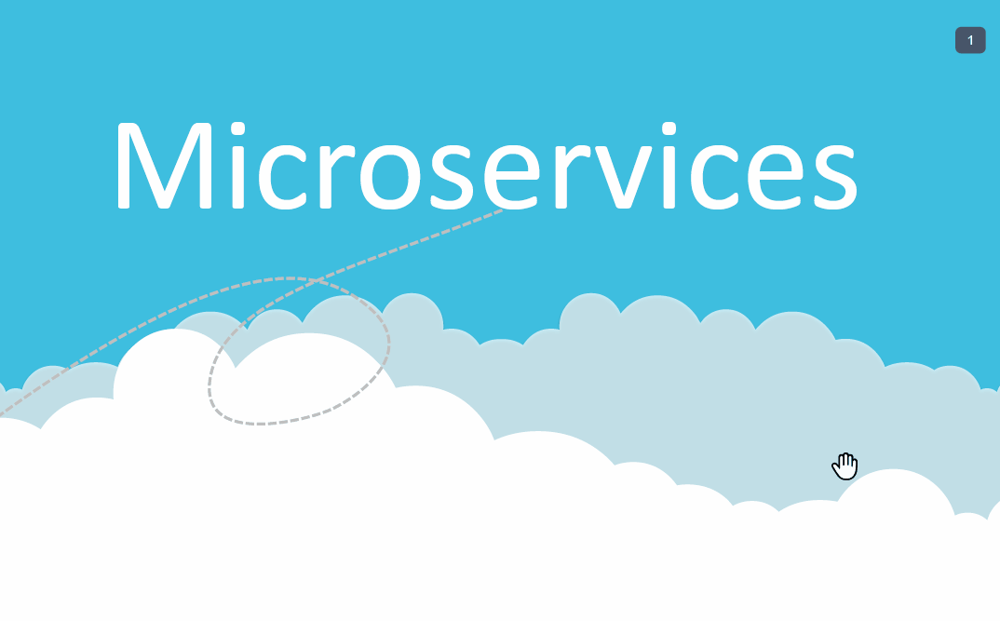

# Cloud Computing Security
## Alexander Souza – ID G00317835 – Student at GMIT- Galway-Mayo Institute of Technology
Abstract — Due to the potential of the cloud for the various IT services, there is a growing concern over security. In this article the various situations in which users are most concerned will be presented, while also addressing some of the most common problems. After analysing the various types of problems, we can also present possible solutions. To better understand these problems, you will be shown some attack surfaces, and alerts for some classic problems.

## [PDF - Cloud Computing Security](https://github.com/alexpt2000gmit/4Year_LiteratureReview/blob/master/Alexander%20Souza%20-%20Cloud%20Computing%20Security.pdf)

# Presentation Microservices

## [PDF - Presentation Microservices](https://github.com/alexpt2000gmit/4Year_LiteratureReview/blob/master/Alexander%20Souza%20-%20%20Microservices.pdf)

# Author

### Alexander Souza
- G00317835@gmit.ie
- alexpt2000@gmail.com
- https://github.com/alexpt2000gmit
- https://github.com/alexpt2000
- www.linkedin.com/in/alexander-souza-3a841539/

